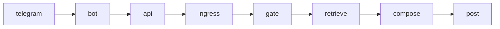

# VanessaAI

A Telegram bot with long-term chat memory, RAG over message history, and
controlled group-chat behavior. A pet project showcasing production-minded AI
system design — not just an LLM wrapper, but a pipeline with gating, retrieval,
and observability.

In a group chat the bot should not reply to everything. VanessaAI is built
around **memory** (relevant history, not a dump), **discipline** (when to
speak or stay quiet), and **character** (persona from config, not hardcoded
jokes).

## How a message is processed



Most group messages never get a reply. Silence is a first-class outcome:
the bot only types after the gate has already decided to speak.

1. **Telegram → bot.** The bot checks chat access. Photos are downloaded
   (albums become one turn). It forwards the turn to the API over HTTP
   SSE or Redis Streams — same pipeline either way.
2. **Ingress.** The sender is upserted, the message is written to
   Postgres, and the session window is loaded (idle timeout + listen
   window, not just last-N).
3. **Gate** — cheap filters first, then a planner suggestion, then
   rules that can still say no:

   | Layer | Role |
   |-------|------|
   | Prefilter | No LLM: noise, dismissal, off-topic remarks |
   | Reaction gate | Cheap YES/NO: people talking among themselves |
   | Turn Planner | LLM: should reply, search query, humor, deep_search |
   | Decision Engine | Rule chain: rate limit, addressing, listen window, relevance |

   The planner suggests `should_reply`. The engine makes the final call.
   Ignore → index the message and stop. Reply → start "typing...".
4. **Retrieve.** Semantic vault RAG first (People / Lore / Culture /
   Logs). Raw-message RAG only if the vault is empty, or as an extra
   ReAct pass when `deep_search` is on. Then optional web search, humor
   RAG + reflexion, and a meme pick behind an anti-spam gate.
5. **Compose.** DeepSeek (or Claude) writes the reply from that
   context. Repeat spam, an `[ignore]` marker, or an empty answer still
   become silence. Stickers and re-sent photos are tags on the same
   reply, not a second model call.
6. **Finalize + post.** Control tags are stripped, the reply is split
   into Telegram messages, the assistant row is stored. Memory extract,
   mood metrics, photo captions, and sampled RAG-Triad eval run in the
   background so they do not block delivery.
7. **Send.** The bot posts the text blocks, then any photo, then a
   sticker if tagged.

Details: [Architecture guide](docs/architecture.md).

## Engineering highlights

- **Knowledge vault** — machine-only People/Lore/Culture/Logs notes,
  index-based aliases, post-reply extract plus a sweep over ignored
  messages; notes live in a Qdrant `knowledge` collection.
- **Semantic-first RAG** — match meaning against vault notes; raw-message
  vector + Postgres FTS only if the archive has nothing relevant.
- **Participant-aware planning** — planner sees compact mood + facts so
  the embedding query uses the right aliases.
- **ReAct retrieval** — when `deep_search=true`, iterative search up to N
  steps if the first pass is thin.
- **Two-track humor RAG** — meme search plus rule-based reflexion so quotes
  are actually on-topic.
- **Pipeline as stages** — `Gate → Retrieve → Compose → Finalize`;
  dependencies via protocols (SOLID, testable).
- **ChatSessionState** — trim by idle timeout and listen window, not only
  message count.
- **Async indexing** — DB write is immediate; Qdrant embedding is background
  with retries.
- REST API (`POST /api/v1/chat`) separate from the bot; automated tests
  under `tests/`.
- **Package layout** — `services/` is transport (bot, API, worker, MCP).
  `vanessa/pipeline/` is the turn use-case; `vanessa/infrastructure/` is
  Postgres, Redis, ingest; `vanessa/knowledge/` is the vault.

## Tech stack

| Category | Stack |
|----------|-------|
| Language | Python 3.12 |
| Bot | aiogram 3 |
| API | FastAPI, uvicorn |
| LLM | DeepSeek (default) or Claude, via provider adapter |
| Embeddings | sentence-transformers (`all-MiniLM-L6-v2`), local CPU |
| Vector DB | Qdrant (HNSW, quantization, on-disk) |
| SQL | PostgreSQL 16, SQLAlchemy 2 async, Alembic |
| Infra | Docker Compose (api, bot, postgres, qdrant) |
| Dependencies | Poetry |

## Observability

Layered across bot and API, correlated by `request_id` (`X-Request-ID`):

- **Prometheus** — turns, stage latency, LLM tokens/errors, RAG hits;
  Grafana dashboard in `grafana/dashboards/vanessa.json`.
- **Langfuse** — span-level RAG pipeline and token usage (off by default).
- **RAG Triad** — sampled LLM-as-judge: context relevance, groundedness,
  answer relevance.
- **Alerting** — Telegram alerts on error rate, p95, empty RAG, provider
  402.

All of this is **off until you enable it** in the overlay env file.

Details: [Observability](docs/observability.md).

## Quick start

Needs Docker Compose. Copy [`.env.example`](.env.example) to `.env.local`
(never commit), fill the secrets in that file, then:

```bash
python scripts/prepare_env.py
docker compose --env-file .env.defaults --env-file .env.local up -d --build
```

`prepare_env.py` is Python (bash and PowerShell). Overlay and
`COMPOSE_FILE` (including Windows `;`) live only in `.env.example`.
Defaults catalog: [`.env.defaults`](.env.defaults).

API: `http://localhost:8000`. Import, tests, prod, k8s:
[Deployment](docs/deployment.md). YAML content:
[Configuration](docs/configuration.md).

## Limitations

Local **CPU MiniLM** and cheap heuristics are a pet-project tradeoff: no
hosted embedding API, no extra vector SaaS. Hallucinations in humor and
“facts about the chat” are bounded by vault-first RAG, humor reflexion,
and sampled RAG Triad — not by a second frontier model on every turn.

- Tuned for **one chat / one instance** — multi-tenancy is not a goal.
- Large archives may need a GPU or an external embedding API.
- Silence vs jokes still depends on rule tuning and how much history is
  in RAG.

<details>
<summary>Illustrative turn (reconstructed, fictional names)</summary>

```
User: Vanessa, what was that about Maxim and that duck?

Gate:
  prefilter: pass
  planner: should_reply=true humor=true deep_search=false
            query="Maxim duck meme lore"
  engine: reply (addressed + relevance)

Retrieve (vault lore):
  glossary/utka.md — quote: "It's not a duck, it's a concept."
  People/maxim.md — "I once argued about waterfowl."

Post: formatting / send

Bot: duck as a concept, Maxim as a person who lived through it.
     I'm not making up the quote—it's in the glossary.
```

</details>

## Docs

- [Architecture](docs/architecture.md)
- [Observability](docs/observability.md)
- [Deployment](docs/deployment.md)
- [Configuration](docs/configuration.md)
