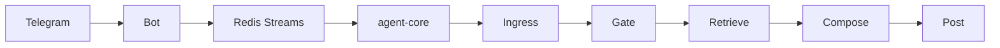

# Architecture

How VanessaAI turns a Telegram message into a reply — or silence. The
landing summary is in the [README](../README.md); this page is the
pipeline, vault, mood metrics, and retrieval tracks.

## Pipeline

- **Ingress** — persist the message, load session, apply nicknames.
- **Gate** — prefilter → Turn Planner → Decision Engine.
- **Retrieve** — semantic vault RAG first, raw-message RAG fallback,
  optional ReAct, humor RAG + reflexion.
- **Compose** — DeepSeek (default) or Claude via the provider adapter.
- **Post** — Telegram formatting, profanity filter.

Orchestrator stages live in `vanessa/services/pipeline/`; dependencies are
wired through protocols (`vanessa/core/protocols.py`) so stages stay
testable. Process entrypoints live under `services/` (`bot`, `agent_core`,
`worker`, `mcp`). Wire contracts are `vanessa/contracts/`; Redis transport
is `vanessa/broker/`.

## Gate

This is the main difference from wrapping ChatGPT.

| Layer | Role |
|-------|------|
| Prefilter | No LLM: noise, dismissal, off-topic remarks |
| Turn Planner | LLM: should reply, search query, humor, deep_search |
| Decision Engine | Rule chain: rate limit, addressing, listen window, relevance |

The planner suggests `should_reply`. It is **not** the single source of
truth. The rule engine uses addressing, session state, and a relevance
threshold. `ChatSessionState` trims context by idle timeout and listen
window, not only by message count.

## Knowledge vault

Beyond raw history, Vanessa keeps structured memory in Postgres
(`knowledge_nodes` + `knowledge_documents`) with Qdrant collection
`knowledge` as the embedding index. `KNOWLEDGE_STORE=filesystem` keeps
the legacy markdown tree for tests and local work.

| Folder | Contents |
|--------|----------|
| `People/` | One card per participant: life context, mood, triggers, quotes |
| `Lore/glossary/` | In-chat memes and neologisms |
| `Lore/events/` | Chronicles of events and arguments |
| `Culture/` | Movie / game / music recommendations |
| `Logs/` | Daily and weekly chat logs |
| `Metrics/` | Mood and relationship time series (YAML) |
| `inbox/` | Manual `/note` entries |

Each row keeps typed columns plus JSONB metadata and a markdown body
with the same headings as the old files. Folder `_index.yaml` manifests
live in `knowledge_documents`. Migrate with
`scripts/migrate_knowledge_to_postgres.py`, then
`scripts/reindex_knowledge_vectors.py`. Observability is request-scoped:
Prometheus (`vanessa_knowledge_*`), Langfuse spans
(`retrieve:knowledge_vault`, `compose:inject_knowledge`,
`finalize:extract_knowledge`), and JSON logs with `node_id` for Loki.

**Write:**

- **Post-reply** — a small LLM pass over recent messages; merge facts and
  quotes without duplicates.
- **Sweep every N messages** — the bot ignores most traffic, so a worker
  chunks the backlog into context-sized windows and extracts what was
  missed, including weekly digests.

**Read** is semantic-first. Vault notes are already summaries (raw chat
embeds poorly). They go into Qdrant collection `knowledge` and are
matched by embedding similarity plus exact alias hits. The planner
picks archives (`people` / `lore` / `culture` / `logs`); humor always
consults lore. Matched notes are the **primary RAG context**. Raw
message history is fallback. Notes re-embed on every write.
`scripts/reindex_knowledge_vectors.py` rebuilds the collection.

## Mood and relationship metrics

Each participant has a typed profile:

| Group | Metrics | Source |
|-------|---------|--------|
| Sentiment | `valence`, `volatility`, `sarcasm_index` | LLM |
| Engagement | `constructiveness`, `toxicity`, `support_index` | LLM |
| Relation to Vanessa | `trust_score`, `distance`, `sympathy` | LLM |
| Behavioral | `presence_stability`, `reactivity_median_s`, `peak_hour` | DB |
| Behavioral (volume) | `active_days`, `message_count`, `reply_rate_to_bot` | DB |

Current snapshot lives in person-card frontmatter (`People/*.md` →
`metrics:`). A per-date series is appended to `Metrics/<person>.yaml`.

Behavioral metrics come from `DeterministicMetricsCalculator` (message
DB). Semantic metrics come from `MetricsPlanner` (LLM). Full pass runs
in the sweep; a throttled deterministic pass runs after replied turns.

`SenderMetricsRule` can ignore chronically toxic, low-trust senders, with
hard guards: never the owner, never direct / triggered / expected replies.
The composer gets a compact mood block to tune tone inside the persona
rules.

## Retrieve tracks

- **Semantic-first RAG** — vault notes first; hybrid vector + Postgres
  full-text on raw messages only if the vault is empty for that query.
- **Participant-aware queries** — planner prompt includes compact
  per-person mood and facts so aliases and topics match.
- **ReAct** — if `deep_search=true`, iterative search up to N steps.
- **Two-track humor** — separate meme search plus rule-based reflexion so
  irrelevant quotes do not land in the prompt.
- **Async indexing** — Postgres write is immediate; Qdrant embedding
  runs in the background with retries.
- **History import** — `scripts/import_telegram_history.py` loads Telegram
  Desktop `result.json` into Postgres + Qdrant in batches.

## Photos and character

Vision (optional) captions images and OCR via a cheap DeepSeek vision
model; captions stay in session for follow-ups. The composer can pick a
meaning-relevant stored photo to re-send. Persona, nicknames, and
Telegram HTML formatting are config-driven (`config/content/`).

See [Configuration](configuration.md) for YAML. Env keys:
[`.env.defaults`](../.env.defaults) and [`.env.example`](../.env.example).
