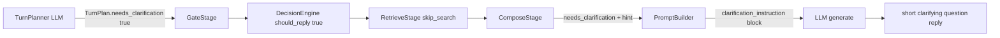

# Plan: Clarification-first dialogue mode (needs_clarification)

## Problem
When the user writes to the bot without enough context (e.g. «ванесса я думаю ты виновата» —
a vague accusation, no prior topic in the session), the bot still answers with a full
defensive/sarcastic reply instead of asking a short clarifying question («Не поняла, почему?»).

Root cause: `TurnPlan` has no notion of "this message is ambiguous / I lack context".
The composer has no signal that a 1-sentence clarifying question is the right move.

## Approach (user-approved)
Planner-driven: the turn planner LLM decides `needs_clarification`; the composer receives an
instruction and replies with one short question. This matches "диалог можно планировать наперёд".

## Data flow

## Changes

### 1. TurnPlan (app/llm/planner/turn_planner.py)
- Add `needs_clarification: bool = False` and `clarification_hint: str = ""`.
- `_parse_llm_response`: parse both fields. When `needs_clarification` is true:
  - force `should_reply=True`
  - force `skip_search=True`, `text=""` (nothing meaningful to search)
- `_fallback`: keep default `False`.

### 2. Planner prompt (config/content/rag.yaml — turn_planner_prompt)
- Add `"needs_clarification": false` to the JSON schema.
- New `## needs_clarification` section: true when the user addresses the bot but the message
  references something with NO grounding in recent context and NO concrete searchable entity
  (pronouns, vague accusations «ты виновата», «опять это», «я знаю что ты сделала», references
  without a named topic). If the recent session or the message names a concrete topic → false.
  When true → should_reply=true, search_query="", skip=true.
- Add example: «ванесса я думаю ты виновата» (no context) → needs_clarification=true,
  should_reply=true, skip=true.
- Clarify contrast with existing «где там» example (recent session HAS the referent → no
  clarification, answer from context).

### 3. Composer config (config/content/llm.yaml)
- Add `clarification_instruction: |` (1-sentence question, no defensiveness, no joke, no sticker).
- Add an `answer_examples` row for the failing case.

### 4. Content model (app/config/content.py)
- Add `clarification_instruction: str = ""` to `LLMContent`.

### 5. Protocol + providers
- `LLMProviderProtocol.generate` (app/core/protocols.py): add keyword-only
  `needs_clarification: bool = False`, `clarification_hint: str = ""`.
- `DeepSeekLLMProvider.generate` and `ClaudeLLMProvider.generate`: accept + forward to
  `build_user_prompt`.

### 6. PromptBuilder (app/llm/prompts/prompt_builder.py)
- Add `needs_clarification: bool = False`, `clarification_hint: str = ""`.
- When `needs_clarification` and `llm.clarification_instruction` is set, append the instruction
  block after the current message (before tone note).

### 7. Pipeline (app/services/pipeline/stages.py)
- `ComposeStage.run`: pass `needs_clarification=ctx.turn_plan.needs_clarification` and
  `clarification_hint=ctx.turn_plan.clarification_hint` to `llm.generate`.

### 8. Logging
- Add `needs_clarification` to `turn_plan` logs in turn_planner.py and `turn_stage plan` log in
  stages.py.

### 9. Decision engine verification
- Confirm `PlannerReplyRule` honors planner `should_reply=True` for the clarify path so the reply
  is not suppressed (same path as any direct address — expected to work, verify in tests).

## Tests
- tests/llm/test_turn_planner.py: parse needs_clarification true/false + forced should_reply/skip.
- tests/llm/test_content.py: clarification instruction present when flag on, absent when off.
- tests/llm/test_claude.py + test_deepseek.py: `generate(needs_clarification=True)` forwards it.
- Any existing pipeline compose test: verify the flag reaches generate.
- Run full `pytest`, fix regressions.

## Out of scope
- Post-RAG confirmation (user chose planner-only decision).
- General `dialogue_mode` enum (future extension).
