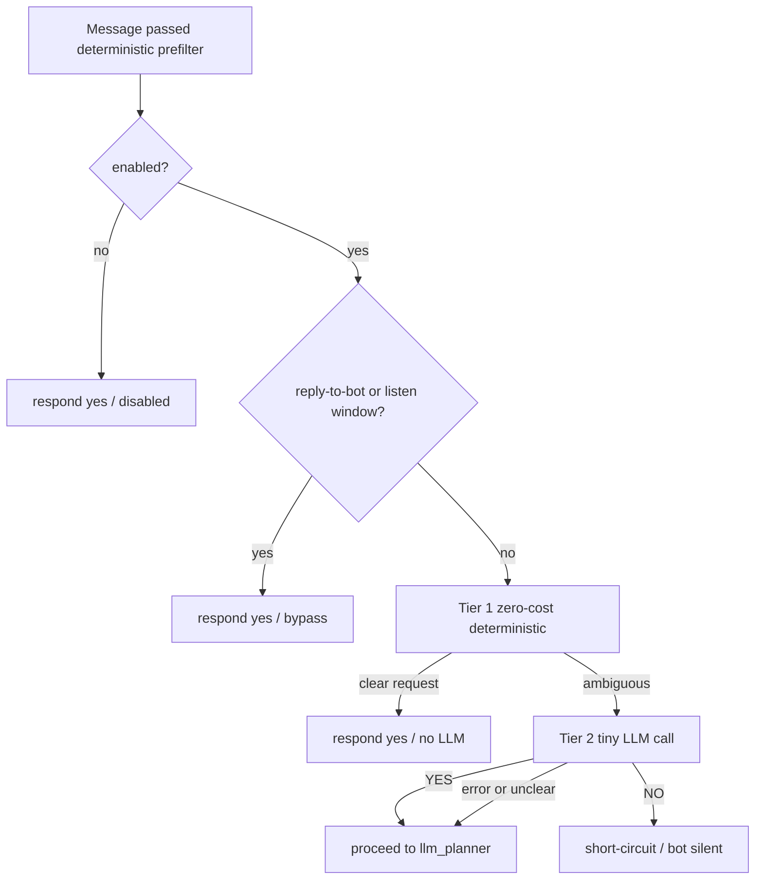

# Lightweight Decision Gate (Reaction Classifier) — two-tier Fast Gate

## Problem

Every message that passes the deterministic prefilter goes through the heavy
LLM turn planner (`TurnPlanner.prepare`) — roughly ~2s — even when the message
does not actually need a bot reaction. In group chats this happens constantly:
people chatting among themselves, the bot's name mentioned in passing, status
remarks, small talk.

## Original v1 and its architectural error

v1 added a single LLM YES/NO call inside `GateStage` right before the planner.
It was correct on safety (fail-open, bypasses) and on the NO short-circuit, but
it had one real flaw the review caught:

- The LLM call ran on **every** turn that reached the planner — including clear
  direct requests ("ванесса, что нового?", "помоги с unity", greetings). That
  added ~0.5–1s of pure overhead to the happy path: a net regression, not a win.

## Corrected design: two-tier Fast Gate

`ReactionGate.evaluate()` becomes tiered so the LLM is **only ever called on the
genuinely ambiguous tail**:

### Tier 1 — zero-cost deterministic short-circuit (no LLM, microseconds)

Pure string checks against cheap signals, all of which already live in the
config (`config/content/decision.yaml`):

- message ends with `?` or contains a **question word** (`question_words`);
- contains a **trigger keyword** (`trigger_keywords`: помоги / объясни / ...);
- contains a **modal request verb** (`modal_verbs`: можно / нужно / стоит);
- contains an **imperative request verb** (small built-in set ∪ trigger_keywords:
  скажи / напиши / сделай / дай / покажи / кинь / ...);
- message **starts with a bot name** (direct address: "ванесса, привет").

Any hit → `respond=True` immediately. The gate adds **zero** latency to clear
requests — this is the fix for the v1 regression.

### Tier 2 — tiny LLM call, ambiguous tail only (~0.3–0.5s)

Only messages with **no** deterministic signal reach the LLM: a bot name
mentioned mid-sentence, a statement that might be side talk, a follow-up with
no question/trigger. These are exactly the cases that are inherently semantic.

- one call to the cheapest non-reasoning model (`deepseek-chat`, $0.27/1M input)
  — overridable via `DECISION_REACTION_GATE_MODEL`;
- `max_tokens=5`, `temperature=0.0`, `kind="reaction_gate"` (already observed by
  Prometheus/langfuse);
- **NO** → `respond=False` → instant short-circuit;
- fail-open: any error or non-YES/NO answer → `respond=True`.

### Why this meets the 0.05–0.1s goal

- Deterministic **NO** cases (side talk, noise, closure, dismissal, quote echo,
  ignored user) are already resolved by `PlannerPrefilter` in **microseconds**
  and never reach the gate. This covers the primary scenario "люди просто
  общаются между собой" with zero LLM cost.
- Deterministic **YES** cases (clear requests) are resolved by Tier 1 in
  **microseconds** with zero LLM cost.
- Only the genuinely ambiguous semantic tail pays one cheap LLM call. Getting
  *that* down to 0.05s would require local inference (embeddings/ONNX), a
  separate task; the LLM tier already uses the cheapest/fastest remote model.

## Short-circuit guarantee (verified)

The NO path is a true short-circuit — no planner, no RAG, no compose:

1. `GateStage.run()`: `respond=False` → `finish_ignore_turn(DecisionReason.REACTION_GATE)`
   → `return False`.
2. `ConversationOrchestrator._handle_incoming_inner()`:
   `if not await self._run_stage("gate", ...): return ctx.result` — retrieve/
   compose/finalize never run.
3. Chat route: `action=ignore, reply=None` → the bot sends nothing; the
   "typing..." `started` event is only emitted after the gate passes, so ignored
   turns never even show typing.

## Implementation steps (Code mode)

1. `app/decision/gate/reaction_gate.py`
   - add `Tier 1` (`_fast_verdict`) before the LLM call in `evaluate()`;
   - derive heuristic lists from `content.decision` (`question_words`,
     `trigger_keywords`, `modal_verbs`, `default_bot_names`) + `settings.bot_name_aliases`
     + built-in `_IMPERATIVE_REQUESTS`; keep them injectable via constructor
     kwargs for hermetic tests;
   - `Tier 2` stays as-is (LLM, fail-open).
2. `app/config/settings.py`
   - `decision_reaction_gate_heuristics_enabled: bool = True` (toggle Tier 1).
3. `.env.example` — document `DECISION_REACTION_GATE_HEURISTICS_ENABLED`.
4. `tests/decision/test_reaction_gate.py`
   - add Tier-1 tests: question / trigger / modal / direct-address → `respond=True`
     with **zero** LLM calls;
   - keep LLM-tier tests (ambiguous → LLM; NO → short-circuit; fail-open);
   - fix the old "positive verdict" test to use an ambiguous message so it
     actually exercises the LLM tier.
5. `plans/decision-gate-reaction-classifier.md` — this document.

## Expected effect

- Clear requests: **zero** added latency (fixes the v1 regression).
- Side talk / passing mentions caught by the deterministic prefilter: **zero**
  added latency, already instant.
- Genuinely ambiguous messages: one cheap LLM call, then either an instant
  short-circuit (NO) or the normal planner path (YES).

## Sender-aware continuation follow-ups ("а ещё")

### Problem

A short follow-up demand right after the bot's own reply — "а ещё" = "tell me
another one" — has none of the usual deterministic signals (no bot name, no
`?`, no trigger/modal verb). It was only saved by the post-reply **listen
window** (`post_reply_listen_count` messages after the bot's reply). When that
window was not active at processing time — other people wrote in between and
the count expired, or the timing fell outside the window — the turn was
silently dropped:

1. `PlannerPrefilter.evaluate_prefilter` returned `side_talk`
   (`run_planner=False`), so the reaction gate never even ran;
2. if it did reach the reaction gate, Tier-1 found no signal and the Tier-2
   LLM frequently answered NO.

### Fix

A deterministic, **sender-aware** continuation detector in
`app/decision/gate/continuation.py`:

- `is_continuation_phrase(text)` — short phrase (≤5 words) matching a
  configurable `continuation_phrases` list (`а ещё`, `ещё`, `давай ещё`,
  `продолжай`, ...), with a built-in fallback set;
- `last_bot_reply_partner_sender_id(recent)` — the user the bot last answered
  (sender of the user message immediately before the last assistant message);
- `is_sender_continuation_demand(text, recent, sender_id)` — phrase match AND
  sender == partner AND the bot's last reply is recent
  (`DEFAULT_MAX_MESSAGES_BACK = 6`, headroom for interleaved talk).

Wired into both gates so the fix holds at either drop point:

- **Prefilter** [`ReplyEligibility.evaluate_prefilter`](../app/decision/gate/reply_eligibility.py):
  returns `PrefilterVerdict(True, "continuation")` before the final `side_talk`
  fallback — works even when the listen window has expired.
- **Reaction gate** [`ReactionGate`](../app/decision/gate/reaction_gate.py):
  Tier-1 `_fast_verdict` returns `respond=True` / `heuristic_continuation`
  (checked **before** the noise short-circuit, so one-word "давай" still
  passes), zero LLM. `sender_telegram_id` is threaded from
  [`GateStage.run`](../app/services/pipeline/stages.py) through
  `ReactionGateProtocol.evaluate`.

Config toggles: `decision_continuation_follow_up_enabled` (settings/env),
`continuation_phrases` (`config/content/decision.yaml`). The reaction-gate
prompt (built-in + YAML) now lists the follow-up case as an explicit YES
example for the LLM tier.

### Why low false-positive risk

The detector only fires for a **short continuation phrase** from the **same
user the bot just answered**, with the bot's reply still in the recent window.
It does not relax general group-chat noise suppression (the listen window
itself stays message-count based, as before).

---

## Addendum: the post-reply window became "the next 4" and the bot participates

Reported bug: the bot was practically impossible to get a reply from unless it
was tagged or replied to. Two messages that were clearly directed at the bot
from context got no answer:

- "ну чет ваще мало" — a continuation right after the bot answered the same
  user's dossier request;
- "хочешь закурить?" — a question to the bot right after she answered the same
  user's riddle.

### Root cause

A stack of "stay silent" gates compounded:

1. The post-reply listen window was only **2** messages wide
   (`post_reply_listen_count: 2`), so "the next 4" was never a concept.
2. [`listen_window_warrants_reply`](../app/decision/gate/reply_expectation.py)
   accepted a `has_question` flag but never used it, and only warranted a reply
   for pronoun-replies / vocative / planner-affirmed — a substantive
   continuation ("ну чет ваще мало") was dropped.
3. The LLM planner prompt told the model `listen_window=yes — reply only on an
   explicit address`, actively discouraging in-window replies.
4. Outside the window, the deterministic prefilter hard-dropped any
   non-addressed question as `side_talk` before the semantic reaction gate even
   ran ("хочешь закурить?" never got "considered").

### Fix

- **Window widened to 4** (`config/content/conversation.yaml`
  `post_reply_listen_count: 4`; mirrored in settings, the Pydantic default and
  `ReplyEligibility` default) — the bot now "considers" the next 4 messages
  after its own reply.
- **In-window thread participation**
  ([`listen_window_warrants_reply`](../app/decision/gate/reply_expectation.py)):
  honor the planner veto (`should_reply is False`), treat `has_question` as a
  warrant, and default to reply for substantive in-window messages that are not
  noise/closure/unsolicited/third-party. Plus a sender-aware fallback in
  [`ListenWindowRule`](../app/decision/rules.py): if the message comes from the
  user the bot just answered, it is an explicit continuation and wins even when
  the planner is neutral or vetoed.
- **Planner prompt** ([`rag.yaml`](../config/content/rag.yaml)): the listen
  window is now described as a participation window (reply to questions /
  follow-ups / comments continuing the dialogue; stay silent only for clear
  side talk, gossip, goodbye), with examples mirroring the reported cases.
- **Question deferral** ([`evaluate_prefilter`](../app/decision/gate/reply_eligibility.py),
  toggle `decision_prefilter_defer_questions`, default true): a non-addressed
  question is no longer hard-dropped as `side_talk` — it is deferred to the
  reaction gate (Tier-1 catches clear questions instantly; the LLM tier decides
  the ambiguous tail). A recent dismissal ("хватит") still closes the thread.
- **Compose allowance** ([`is_addressed_to_bot`](../app/decision/gate/addressing.py)):
  a question in an active conversation is a compose candidate, so a
  session-approved out-of-window question survives the compose gate instead of
  being downgraded to `NOT_EXPECTED`.

### Cost trade-off

Widening the window and deferring questions means more turns reach the LLM
planner/reaction gate than before (they get "considered" and then often
ignored). The reaction-gate Tier-1 heuristics still short-circuit clear
requests and obvious noise with zero LLM cost; the deterministic prefilter
still resolves noise/closure/dismissal/third-party cheaply. `DECISION_PREFILTER_DEFER_QUESTIONS=false`
restores the previous cheap-but-silent behavior.
