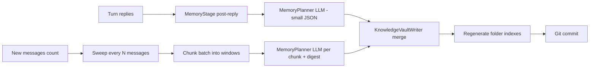
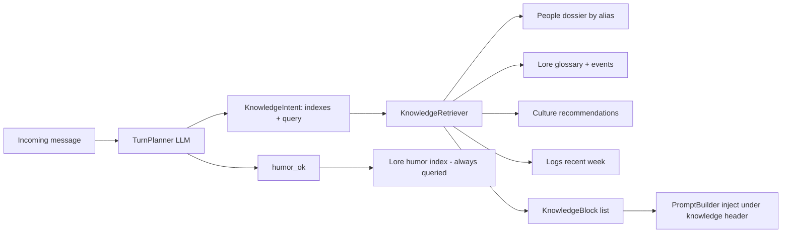

# VanessaAI Knowledge Vault — Optimized Storage & Retrieval

## Goal

Give Vanessa her **own** structured long-term knowledge base — not the owner's
personal Obsidian vault, but a repo-local, git-tracked folder she writes to and
reads from. Inspired by the Obsidian folder idea, but optimized as a format that
an LLM can **write deterministically**, **update in place**, and **retrieve by
intent without scanning the whole vault**.

Target use cases:
- "Что там было про Макса и утку прошлым летом?" → Lore index.
- "Ванесса, чего там у Лича?" → People dossier.
- Humor module always consults the humor/Lore part (memes, glossary, quotes).
- Weekly digest: who talked the most, what topic, mood of the chat.

Two write triggers (because she does not reply to every message):
1. **Post-reply extraction** — after each reply she makes, a cheap LLM decision
   "is there anything worth persisting from recent messages?"
2. **Periodic sweep every N messages** — a background worker analyzes a large
   batch of messages (chunked to fit the context window) even for messages she
   never replied to.

## Vault location

- Default: `./knowledge/` (new setting `KNOWLEDGE_PATH`), a **plain directory**
  in the project working tree.
- Versioned as its **own git repo** (git init + commit per write), reusing the
  existing commit/push helper from `ObsidianNoteService`. This keeps the bot's
  commits independent of the main project repo and gives auditability + rollback.
- NOT tied to the owner's personal vault. The old `OBSIDIAN_VAULT_PATH` flow
  (`/note` → external vault) stays as-is for owner notes; the new structured
  `/note` target is `knowledge/inbox/`.
- **Machine-only**: no human opens this vault, so no human-facing MOC / wikilink
  layer is kept — only machine `_index.yaml` manifests.

## Folder taxonomy

```
knowledge/
  People/                       # one stable card per participant
    _index.yaml                 # machine index (bot-maintained)
    evgeny.md
    lich.md
  Lore/                         # memes, inside jokes, chronicles
    _index.yaml
    glossary/utka-maksa.md      # one stable file per meme / neologism
    events/2026-08-26-spor-o-tosterakh.md
  Culture/                      # shared recommendations
    _index.yaml
    movies/<slug>.md
    games/<slug>.md
    music/<slug>.md
  Logs/                         # chat diary
    _index.yaml
    daily/2026-08-26.md
    weekly/2026-W35.md
  inbox/                        # manual /note entries (owner-fed)
```

## File naming rules (optimization #1: stable IDs)

- **Stable entity files** (People cards, Glossary entries, Culture
  recommendations): one file per entity, deterministic lowercase slug
  (`utka-maksa.md`). Updates MERGE into the existing file — never a new file per
  event. This is what keeps dossiers accumulating instead of fragmenting.
- **Append-only dated files** (Events, Logs, daily/weekly): `YYYY-MM-DD-<slug>.md`.
- **Index manifests**: `_index.yaml` (machine registry) only — no human reads
  this vault, so there is no human MOC / wikilink layer. The bot regenerates
  `_index.yaml` after every write.
- Slugs are stable and never renamed unless a canonical alias changes.

## Frontmatter schema (optimization #2: typed, deterministic)

Common fields (every file):

```yaml
---
type: person | glossary | event | recommendation | log | note | index
id: utka-maksa                 # stable slug, equals filename base
aliases: [утка Макса, утка]    # nicknames for matching
people: [Личь, Макс]           # display names involved
tags: [мем, спорт]
created: 2026-08-26
updated: 2026-08-26
status: active                 # active | archived
source_message_ids: [1234, 5678]  # traceability back to chat archive
---
```

Type-specific:

| type | extra frontmatter | body sections (fixed headings) |
|------|-------------------|--------------------------------|
| person | `telegram_id`, `mood` | `## Контекст жизни` / `## Настрой и метрики` / `## Триггеры и темы` / `## Цитатник` / `## Хроника` |
| glossary | `first_seen`, `first_quote`, `related: [slugs]` | `## Значение` / `## Пример` / `## История` |
| event | `date`, `participants`, `outcome` | `## Суть` / `## Хронология` / `## Чем закончилось` |
| recommendation | `kind: movies|games|music`, `status: proposed|consumed|liked|skipped`, `recommended_by`, `rating` | `## Описание` / `## Отзывы` |
| log | `period: daily|weekly` | `## Темы` / `## Настроение` / `## Статистика` |
| note | (inbox only) | free text |

Fixed section headings are a contract: the writer fills them, the reader renders
them, the LLM updates them predictably.

## Index system — the "system of indexes with links" (optimization #3: O(1) routing)

The vault is machine-only (no human browses it), so each folder keeps a single
machine registry `_index.yaml` that the bot loads into memory and refreshes by
mtime:

```yaml
# People/_index.yaml
people:
  telegram_id:
    123456: { id: evgeny, file: evgeny.md, names: [Евгений Капустин] }
  aliases:
    евгений: { id: evgeny, file: evgeny.md }
    евген: { id: evgeny, file: evgeny.md }
    личь: { id: lich, file: lich.md }
```

```yaml
# Lore/_index.yaml
glossary:
  aliases:
    утка макса: { id: utka-maksa, file: glossary/utka-maksa.md }
events:
  - { id: ..., file: events/2026-08-26-....md, date: 2026-08-26 }
```

```yaml
# Culture/_index.yaml
movies: [{ id: ..., file: movies/....md, title: ..., status: liked }]
```

The retriever resolves **nickname → canonical file in O(1)** via the alias map;
it never walks the whole tree. The root `_index.yaml` points to the four folder
manifests.

## Write path



### Trigger A — MemoryStage (per replied turn)

Placed after `FinalizeStage` in the orchestrator. **Fail-open** (never blocks or
fails the visible reply) and throttled by `KNOWLEDGE_MEMORY_COOLDOWN_SECONDS`.

1. Build compact transcript from `ctx.recent` + current message (reuse session
   formatter).
2. One LLM call (`memory_planner`, small `max_tokens`, strict JSON) →
   `MemoryPlan`:

```json
{
  "updates": [
    { "type": "person_mood", "person": "evgeny", "mood": "устал", "evidence": "..." },
    { "type": "person_fact", "person": "lich", "section": "triggers", "text": "..." },
    { "type": "quote", "person": "lich", "quote": "...", "context": "..." },
    { "type": "glossary", "term": "утка Макса", "aliases": ["утка"],
      "definition": "...", "first_quote": "..." },
    { "type": "event", "title": "Спор о тостере", "participants": ["..."] },
    { "type": "recommendation", "kind": "movies", "title": "...", "recommended_by": "..." }
  ]
}
```

3. `KnowledgeVaultWriter.apply(plan)` — merge semantics:
   - `person_mood` → update `mood` frontmatter + append dated line to
     `## Настрой и метрики`.
   - `quote` → append bullet to the person's `## Цитатник` (idempotent by quote
     hash + `source_message_ids`).
   - `glossary` → upsert stable file by slug; fill `## Значение` / `## Пример`.
   - `event` → create/append to `Lore/events/<date>-<slug>.md`.
   - `recommendation` → upsert `Culture/<kind>/<slug>.md`, update status/rating.
4. Regenerate affected `_index.yaml` + `_index.md`; git commit.

### Trigger B — Sweep every N messages (background worker)

Because she ignores most messages, post-reply extraction alone would miss most
of the chat. A background task (started in the API lifespan, mirroring the
indexing worker pattern) does:

1. Persist a **cursor** (last processed message id) — e.g. a `knowledge_state`
   file in the vault root, or `count_since`/`get_newer_than` on the DB.
2. Every `KNOWLEDGE_SWEEP_INTERVAL_MESSAGES` new messages: fetch up to
   `KNOWLEDGE_SWEEP_BATCH_SIZE` messages since the cursor.
3. **Chunk** the batch into overlapping windows of `KNOWLEDGE_SWEEP_WINDOW_SIZE`
   (e.g. 40 msgs, 10 overlap) so each LLM call fits the context window. Optionally
   roll a compact running digest between chunks to avoid losing cross-chunk
   context.
4. Each chunk → `MemoryPlan`; aggregate; `KnowledgeVaultWriter.apply` with
   idempotency keys (same `source_message_ids` + stable slugs as Trigger A, so
   the two triggers never duplicate).
5. Advance cursor; git commit. Weekly log entries are produced when the sweep
   crosses a week boundary or on a schedule.

## Read path — intent-routed retrieval



1. Extend `TurnPlan` with `knowledge_indexes: list[str]` and `knowledge_query`.
   The planner prompt now asks which archives to consult (`people`, `lore`,
   `culture`, `logs`) and a short query. Default `[]` = no knowledge injection
   (keeps cost and context low).
2. New `KnowledgeRetriever`:
   - **Always** consults the Lore/humor part when `humor_ok`/`humor_query`
     (complements the existing message-based `HumorPipeline` with curated vault
     memes).
   - **people** → resolve aliases (from `People/_index.yaml`) against message
     text / mentioned nicknames → read the dossier(s).
   - **lore** → glossary alias map + token-scored events.
   - **culture** → entries by `kind` + `status`.
   - **logs** → most recent weekly/daily logs.
   - Returns `list[KnowledgeBlock]` (path, title, kind, rendered content).
   - v1 uses index + lightweight token scoring (no embeddings). Qdrant indexing
     of notes is a possible later enhancement.
3. Injection: add `knowledge_blocks` to `LLMProviderProtocol.generate` and
   `PromptBuilder.build_user_prompt`, rendered under a new `knowledge_header`
   ("Из моего архива по теме:") in `config/content.yaml` — exactly mirroring the
   existing `humor_quotes` mechanism. Threaded through deepseek/claude providers.

## Config additions

`settings.py`:

| setting | default | meaning |
|---------|---------|---------|
| `knowledge_path` | `knowledge` | vault root (repo-local) |
| `knowledge_git_enabled` | true | git commit per write (own repo) |
| `knowledge_memory_enabled` | true | post-reply extraction on/off |
| `knowledge_memory_cooldown_seconds` | 300 | throttle post-reply LLM calls |
| `knowledge_memory_max_tokens` | 512 | memory decision call size |
| `knowledge_sweep_enabled` | true | periodic sweep on/off |
| `knowledge_sweep_interval_messages` | 50 | run sweep every N messages |
| `knowledge_sweep_batch_size` | 200 | max messages per sweep |
| `knowledge_sweep_window_size` | 40 | messages per LLM chunk |
| `knowledge_sweep_window_overlap` | 10 | overlap between chunks |
| `knowledge_model` | "" | optional separate model (falls back to composer) |

`config/content.yaml`:
- new `llm.knowledge_header`
- new `memory:` section with extraction system + user prompt templates
- planner prompt extended with `knowledge_indexes` / `knowledge_query`.

## Files to touch

New `app/knowledge/` package:
- `format.py` — slugify, YAML frontmatter parse/render, path helpers
- `schema.py` — `KnowledgeBlock`, `MemoryUpdate`, `MemoryPlan`, `FolderIndex`
- `vault.py` — `KnowledgeVault`: structure ensure, file IO via `to_thread`,
  git commit (refactor git helper out of `ObsidianNoteService`)
- `index.py` — `KnowledgeIndex`: load/refresh `_index.yaml`, alias resolution,
  mtime cache
- `writer.py` — `KnowledgeVaultWriter`: merge semantics, idempotency, index regen
- `retriever.py` — `KnowledgeRetriever`: intent routing + fetch
- `memory_planner.py` — LLM call producing `MemoryPlan`
- `sweep.py` — `SweepAnalyzer` + background worker (cursor, chunking, digest)
- `memory_stage.py` — `MemoryStage` (post-finalize hook, fail-open)

Modified:
- `app/core/protocols.py` — `KnowledgeRetrieverProtocol`; `generate(..., knowledge_blocks)`; repository `count_since` / `get_newer_than`
- `app/core/messages.py` — `KnowledgeBlock` dataclass
- `app/db/repository.py` — cursor queries
- `app/llm/planner/turn_planner.py` — knowledge fields + parsing + prompt
- `app/llm/prompts/prompt_builder.py` — render knowledge blocks
- `app/llm/providers/protocols.py`, `deepseek.py`, `claude.py` — pass-through
- `app/services/pipeline/stages.py`, `context.py` — `ctx.knowledge_blocks`,
  knowledge fetch in RetrieveStage, pass to ComposeStage
- `app/services/orchestrator/conversation_orchestrator.py` — run MemoryStage after finalize
- `app/api/main.py` — start sweep background task in lifespan
- `app/config/settings.py`, `config/content.yaml`
- `app/bot/handlers/notes.py` — `/note` → `knowledge/inbox/`
- `app/bot/container.py` / `app/api/container.py` — DI wiring
- `tests/` — new `tests/knowledge/...`; update provider/prompt/planner/notes tests

## Implementation phases

1. **Vault core + format** — package, schema, vault IO, index manifests,
   `/note` → inbox, git. Pure storage, fully testable without an LLM.
2. **Read path** — TurnPlan knowledge intent, `KnowledgeRetriever`, prompt
   injection, wiring. (Unlocks answering "what was that about X".)
3. **Write path incremental** — MemoryStage + memory_planner + writer merge.
4. **Write path sweep** — DB cursor, background worker, chunking/digest, weekly
   logs.
5. **Config + DI + docs** — settings, content.yaml prompts, README, full test pass.
