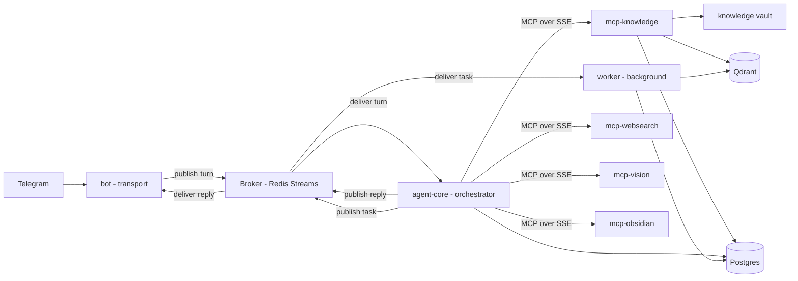

# VanessaAI — MCP Compliance & Service Decomposition Plan

## Goal

Incremental migration of the VanessaAI monolith toward:

1. **Bounded-context service split** — each service owns one business capability.
2. **Async broker decoupling** — bot and background work no longer block the agent loop.
3. **MCP protocol compliance** — external tools, data access and integrations become
   independent MCP servers, called over SSE, never imported as code.
4. **docker-compose stays green** throughout — K8s is designed later as a separate phase.

## Current state (baseline)

| Concern | Today |
|---|---|
| Package | Single `vanessa` Poetry package, `app/` |
| Deploy units | 2 containers, one image: `bot` (aiogram) + `api` (FastAPI) |
| Bot to core | Synchronous HTTP `POST /api/v1/chat`, 2–6s+ wait |
| Agent core | Gate → RAG → Compose → Critique → Finalize, inside the API |
| Background | In-process `BackgroundExecutor` (sweep, portrait, memory, indexing) |
| Embeddings | `sentence-transformers`, loaded in the API process |
| Data | Postgres, Qdrant |
| Observability | Langfuse (OTLP), ClickHouse, Redis, MinIO, Prometheus, Grafana |
| Broker / MCP / K8s | none |

## Target architecture

## Bounded contexts (services)

| Service | Responsibility | Deploys as | Talks to |
|---|---|---|---|
| `bot` | Telegram polling, formatting, media groups, typing | container | broker only |
| `agent-core` | Gate → RAG → Compose → Critique → Finalize | container (scalable) | broker, Postgres, MCP servers |
| `worker` | sweep, portraits, memory, message indexing, vector reindex | container | broker, Postgres, Qdrant, MCP-knowledge |
| `mcp-knowledge` | vault read/search + RAG retrieval as MCP tools | container, SSE | Qdrant, Postgres, vault |
| `mcp-websearch` | web search tools (DDG / Serper / Tavily) | container, SSE | external search APIs |
| `mcp-vision` | photo caption / describe tools | container, SSE | vision LLM |
| `mcp-obsidian` | notes read/write | container, SSE | Obsidian vault / SSH |
| `broker` | Redis Streams (already deployed for Langfuse) | container | — |

## Key decisions

1. **Redis Streams over RabbitMQ for now.** Redis is already in the compose stack
   (Langfuse queue). Zero new infrastructure; consumer groups give at-least-once
   delivery; RPC uses a reply stream + correlation ID. RabbitMQ stays a drop-in
   behind `BrokerProtocol`. Kafka is deferred — only warranted for replayable
   event sourcing of LLM logs, which is not the current goal.
2. **MCP for external tools only, never the core pipeline.** The deterministic
   decision engine (gate rules), RAG orchestration and compose stay in-process:
   they are fast, tightly coupled and covered by 500+ unit tests. Only genuinely
   external/tool-like capabilities become MCP servers. This corrects the trap of
   "MCP-ify everything".
3. **Transactional outbox + idempotent consumers + DLQ.** DB writes and broker
   publishes happen in one DB transaction (outbox); a relay publishes rows.
   Consumers dedupe by request/correlation ID; poison messages go to DLQ streams.
4. **Fail-open MCP + circuit breaker.** An MCP server being down must not block a
   reply — bounded timeouts, retries, and config-driven fallback to in-process
   providers (as today's code is still wired through protocols).
5. **Per-service settings.** The 496-line monolithic `Settings` is split per
   service over a shared base, so `bot` does not load RAG thresholds and no YAML
   holds secrets — everything stays env-driven for the future K8s ConfigMaps/Secrets.
6. **Trace propagation across hops.** `request_id` / Langfuse `trace_id` ride in
   broker message headers and MCP requests so spans connect
   bot → agent-core → worker/MCP servers.
7. **Contract-first schemas.** Broker messages and MCP tool schemas are versioned
   pydantic models in `contracts/`. Services never import each other's code.

## Phased roadmap

- **Phase 1 — Foundations**: contracts, per-service settings, `BrokerProtocol` +
  Redis Streams, outbox + idempotency + DLQ, bot→core decoupling over turns/replies
  streams with HTTP fallback, trace propagation.
- **Phase 2 — MCP servers**: standalone `mcp-websearch`, `mcp-knowledge`,
  `mcp-vision`, `mcp-obsidian` (each own pyproject + image), agent-core wired as an
  MCP client with fail-open fallback.
- **Phase 3 — Worker extraction**: heavy background work moves to the `worker`
  container consuming fire-and-forget tasks, isolating CPU/RAM from the agent loop.
- **Phase 4 — Observability & tests**: queue metrics, DLQ alerts, contract tests,
  broker integration tests, end-to-end async smoke test, updated compose/deploy.
- **Phase 5 — K8s design (later)**: manifests per service with resources limits,
  ConfigMaps/Secrets, HPA, NetworkPolicies — designed, not yet implemented.

## Definition of done (per phase)

- All existing tests still pass; the compose stack runs with zero downtime.
- Every new hop (broker, MCP, worker) has a config flag that reverts to the
  previous in-process path.
- Each service exposes `/health/ready` and Prometheus metrics.
- No secrets in code or YAML.

## Status — Phase 1 (implemented)

- `app/contracts/` — versioned pydantic wire schemas (`TurnRequest`,
  `TurnStarted`, `TurnReply`, `TaskMessage`) with schema/message/correlation ids.
- `app/broker/` — `RedisStreamBroker` (Redis Streams) with non-blocking poll
  loop, RPC request/reply over private reply streams, `RedisDedupGuard`
  idempotency, DLQ, and Prometheus counters.
- `app/outbox/` — `OutboxEvent` model (migration `009`), `OutboxRepository`,
  `OutboxRelay` (poll → publish → ack, retries + failed cap).
- Settings split into per-service sections (`SharedSettings` + `BotMixin` /
  `CoreMixin` / `WorkerMixin` / `McpMixin`; concrete `BotSettings`,
  `CoreSettings`, `WorkerSettings`, `McpSettings`); the aggregate `Settings`
  keeps every legacy import working (verified: zero field/default drift).
- Transport decoupling: `BotTurnClient` (RPC over broker) and
  `BrokerTurnWorker` (runs the exact `build_orchestrator` pipeline) behind
  `TRANSPORT=http|redis`; HTTP stays the default, broker is a drop-in.
- `request_id` / `trace_id` propagate through the wire and into the pipeline.
- Config: new `TRANSPORT` / `BROKER_*` / `OUTBOX_*` / `MCP_*` env vars documented
  in `.env.example`; `redis` + `fakeredis` deps added.

Phase 1 is fully unit-tested (contracts, broker, outbox, worker, client).
The default `TRANSPORT=http` means the stack runs exactly as before.

### Phase 5 (implemented as a reference design)

`deploy/k8s/` contains the K8s design + apply path:
- `README.md` — topology, ConfigMap/Secret mapping, HPA, NetworkPolicies, PVCs.
- Secrets: `scripts/k8s_secrets.py` is the only entry point (catalog in
  `app/k8s/secrets.py`). No placeholder Secret YAML in git.
- `00-namespace.yaml`, `10-configmap.yaml`, `kustomization.yaml`,
  `20-agent-core.yaml` (Deployment+Service+HPA), `21-bot.yaml`,
  `22-worker.yaml` (Deployment+HPA), `23-mcp-servers.yaml` (4× Deployment+Service),
  `30-networkpolicy.yaml` (opt-in default-deny), `40-pvc.yaml`.
- All manifests + the compose/prometheus/grafana files validate as YAML/JSON.

## Status — Phase 4 (implemented)

- Queue-health metrics: `BrokerMetricsCollector` (`app/broker/metrics_collector.py`)
  refreshes `vanessa_broker_stream_length` / `vanessa_broker_consumer_lag` /
  `vanessa_broker_dlq_depth` gauges; wired into the API lifespan and the worker
  main. The broker exposes `stream_length()` / `consumer_lag()` probes.
- Prometheus alert rules (`prometheus/rules.yml`): DLQ growth, consumer lag,
  worker DLQ backlog; referenced from `prometheus.yml` with new
  `vanessa-worker` and `vanessa-mcp` scrape targets.
- Grafana dashboard `grafana/dashboards/vanessa-broker.json` (auto-provisioned):
  publish/consume rates, DLQ growth, stream length, consumer lag, MCP RPC p95.
- MCP servers now expose `/health` + `/metrics` next to `/mcp` (runner wraps the
  MCP app), so each isolated service is scrapable and health-checked.
- Tests: end-to-end async smoke test (`tests/e2e/`) — real `BrokerTurnClient`
  ↔ `BrokerTurnWorker` round-trip incl. typing + request-id propagation; MCP
  knowledge contract test (live HTTP `vault_find` against a tmp vault); broker
  metrics-collector test.
- Deployment: `docker-compose.yml` adds `mcp-websearch` / `mcp-knowledge` /
  `mcp-vision` / `mcp-obsidian` services (own resource limits + `/health`
  checks) and resource limits for `worker`; `docker-compose.prod.yml` overrides
  drop the dev mounts for all new services.

## Status — Phase 3 (implemented)

- `app/worker/` — dedicated background worker service:
  - `dispatcher.py` — `TaskDispatcher` protocol + `BrokerTaskDispatcher`
    (publishes `TaskMessage`s to the task stream) + `NoopTaskDispatcher`.
  - `handlers.py` — `IndexMessageHandler` (embed + Qdrant upsert + point-id
    persist), `SweepHandler`, `PortraitHandler`, `ReindexKnowledgeHandler`,
    assembled by `build_worker_handlers()` (returns a `WorkerAssembly`).
  - `app.py` — `WorkerApp`: consumes the task stream (consumer group from
    settings, dedup, DLQ on handler failure) and optionally runs the
    sweep/portrait polling loops.
  - `main.py` — entrypoint (`python -m app.worker.main`) with its own
    Prometheus endpoint; polling loops only start in worker mode.
- Routing: `MessageIndexingService.schedule` publishes `INDEX_MESSAGE` when a
  `TaskDispatcher` is injected (worker mode), otherwise keeps the in-process
  executor — the default is unchanged. `deps.get_task_dispatcher()` is a lazy
  singleton used by both the HTTP dependency and the broker turn worker.
- Deployment: `docker-compose.yml` gains a `worker` service (same image,
  `python -m app.worker.main`) with its own CPU/RAM isolation; the API skips
  starting sweep/portrait when `WORKER_ENABLED=true`.
- Tests: dispatcher publish, all handlers, `WorkerApp` dispatch, and indexing
  routing (dispatcher vs background) — 11 new tests.

## Status — Phase 2 (implemented)

- `app/mcp_server/` — four standalone MCP servers built on the official MCP
  2.x SDK (`MCPServer`), each a thin wrapper over real logic:
  - `websearch` — `web_search` tool (wraps the configured search provider).
  - `knowledge` — `vault_read` / `vault_find` tools over the knowledge vault.
  - `vision` — `describe_photo` tool (DeepSeek vision captioner).
  - `obsidian` — `note_save` / `note_status` tools (Obsidian vault).
  - `runner.py` — `python -m app.mcp_server.runner <name> --port 
` runs any
    server over Streamable HTTP at `/mcp` (isolated process/container).
- `app/mcp/` — agent-core client: `McpClientProtocol`,
  `StreamableHttpMcpClient` (Streamable HTTP), `CircuitBreaker`
  (closed/open/half-open), `FailOpenMcpClient` (circuit breaker + fail-open
  fallback), `McpWebSearch` (a `WebSearchService` adapter).
- Wiring: `create_web_search()` returns the MCP-backed search when
  `MCP_WEBSEARCH_URL` is set, otherwise the in-process provider — a
  config-only swap that keeps the Retrieve stage untouched.
- Tests: server tool registration, client circuit-breaker/fail-open behavior,
  `McpWebSearch` parsing, factory selection, and a live HTTP round-trip
  (uvicorn server ↔ `StreamableHttpMcpClient`).
- Run servers: `python -m app.mcp_server.runner websearch --port 8101` (etc.);
  the `MCP_*_URL` env vars in `.env.example` point the agent core at them.
