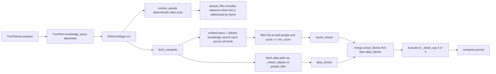

# Plan: Person queries always retrieve "ванесса" (self) instead of the queried person

## Symptom

Archive note: `[person] ванесса: всегда только ванессу находит(себя)` — for a
person query, retrieval returns only Vanessa's own card instead of the queried
person.

Reproduction (planner output, correct):
```json
{
  "should_reply": true,
  "search_query": "вероника",
  "skip": false,
  "knowledge_indexes": ["people"],
  "knowledge_query": "вероника",
  "knowledge_detail": false,
  ...
}
```
The planner correctly targets `вероника`, but the retrieved knowledge block is
`ванесса`'s dossier/portrait.

## Retrieval flow (relevant code)



Key code:
- [`app/services/pipeline/stages.py`](../app/services/pipeline/stages.py:229) — `RetrieveStage.run` resolves `people_files` and calls `fetch_semantic`.
- [`app/knowledge/retriever.py`](../app/knowledge/retriever.py:218) — `fetch_semantic` merges `vector_blocks + alias_blocks` and truncates.
- [`app/knowledge/retriever.py`](../app/knowledge/retriever.py:110) — `fetch` uses `people_files` (forced set) or `_match_aliases`.
- [`app/knowledge/entities.py`](../app/knowledge/entities.py:92) — `mentioned_people_in_text`; the bot's own alias `ванесса` matches whenever the user addresses the bot.
- [`app/rag/qdrant_client.py`](../app/rag/qdrant_client.py:281) — `KnowledgeQdrantStore.search` returns top-k across ALL kinds (no Qdrant-side kind filter).
- [`app/knowledge/vector_index.py`](../app/knowledge/vector_index.py:127) — `index_all` seeds the collection; `index_note` re-embeds a single note after a vault write.

## Candidate root causes (ordered by likelihood)

### RC-1. The target person is crowded out / truncated by the merge + cap
In `fetch_semantic` the merged list is `vector_blocks + alias_blocks` and then cut
to `_detail_cap` (3 normally, 5 on detail). `vector_blocks` come first, so if the
vector search returns 3+ people hits that are not the target, the target (which
may only exist in `alias_blocks`, or be forced via `people_files`) lands at
position 4+ and is truncated away. Because users address the bot by name
("ванесса, что там у вероники"), `resolve_people` includes the bot's own card,
and it sorts first — crowding out the real target.

### RC-2. The bot's own card ("ванесса" = self) is treated as a normal participant
There is no notion of "this card is the bot itself" in the vault. The People
`_index.yaml` alias map contains `ванесса` → `People/ванесса.md`, so the bot's
own dossier is always a valid retrieval target and a valid member of
`people_files`. It competes for the same budget as real people and is often the
top vector hit for weak name queries.

### RC-3. Stale / partial knowledge vector index
The Qdrant `knowledge` collection is seeded at startup by `index_all` and updated
per-note by `index_note`. If a dossier (e.g. `вероника`) was created or heavily
edited after the last successful indexing, its vector is absent or stale in the
collection. The vector search then cannot rank it, so only the people that ARE
indexed (including `ванесса`) are returned, and RC-1 truncation drops the alias
hit.

### RC-4. Query/document embedding asymmetry for person titles
Documents are embedded as `[people] <title>\n<body>` (`_embed_text`), while the
query is embedded raw (`вероника`). For a bare name the local SentenceTransformer
may rank the bot's generic dossier above the target's. Enriching the query with
the same `[people] <name>` framing (or embedding `кто такой <name>`) would align
query and document space.

## Fix plan (defense-in-depth, ordered)

### Fix 1 — Deterministic target must always survive the cap (core fix)
In `fetch_semantic` (and `fetch`), when `people_files` is provided or an alias
resolves the query to a concrete person, guarantee those dossiers are in the
final result:
- Merge order: put `alias_blocks`/resolved-people first (or reserve their slots)
  before vector-only matches.
- Prefer the alias/exact person hit over generic vector hits so a named person
  is never truncated by `_detail_cap`.
This fixes RC-1 and RC-3 directly.

### Fix 2 — Suppress / down-rank the bot's own card for other-person queries
Identify the bot's own People card (via bot-name aliases from
`get_bot_name_aliases()` or a new `self: true` marker in `People/ванесса.md`
frontmatter) and:
- Exclude it from `people_files` when at least one non-self person is the target;
- Down-rank or exclude its vector hits when `knowledge_query` targets another person.
Keep it retrievable when the query is genuinely about the bot ("кто ты",
"расскажи про себя"). This fixes RC-2.

### Fix 3 — Vector index freshness
- Ensure `index_note` runs after every vault write (verify writer path in
  `app/knowledge/writer.py` and `app/knowledge/memory_stage.py`).
- Provide/confirm the reindex command (`python scripts/reindex_knowledge_vectors.py`)
  so a stale collection can be rebuilt; run it after bulk edits.
This fixes RC-3 at the source.

### Fix 4 — Query embedding symmetry
When composing the embedding query for a people search, build it in the same
shape as the indexed notes, e.g. `[people] <knowledge_query>` or
`кто такой <name>`, so bare names rank against the right dossier. Verify against
the actual embedding model (`settings.embedding_model_name`). This addresses RC-4.

## Diagnostics to run first (confirm which RC is active)

1. Inspect the Qdrant `knowledge` collection for the target dossier:
   - Check that `People/вероника.md` has a point (`KnowledgeQdrantStore.point_id`).
   - Dump the top-10 hits for the embedded query `вероника` with
     `path`/`kind`/`score` to see where `ванесса` and `вероника` actually rank.
2. Add temporary logging in `fetch_semantic`:
   - log `people_files` from the resolver;
   - log raw vector hits (`path`, `kind`, `score`);
   - log final merged block paths and the truncation cap.
3. Reproduce with the real message (e.g. "ванесса что там у вероники") and read
   the `knowledge_fetch_semantic` / `rag_search` logs.

## Tests to add (regression)

- `fetch_semantic` with `people_files=["People/ванесса.md", "People/вероника.md"]`
  and a vector hit list that ranks `ванесса` above `вероника` → assert `вероника`
  is present in the returned blocks even when `max_blocks` is small.
- `fetch_semantic` for query `вероника` → assert the bot's own card
  (`People/ванесса.md`) is NOT returned when the target is another person.
- `resolve_people("ванесса что там у вероники")` → assert the bot's own card is
  filtered out while `вероника` is kept (post-Fix-2 behavior).
- Reindex/idempotency: `index_note("People/вероника.md")` produces a point
  searchable by `вероника`.

## Files to change

- [`app/knowledge/retriever.py`](../app/knowledge/retriever.py) — merge order, self-card handling, guaranteed inclusion.
- [`app/knowledge/entities.py`](../app/knowledge/entities.py) — optional: self-card awareness in `resolve_mentioned_people`.
- [`app/knowledge/vector_index.py`](../app/knowledge/vector_index.py) — optional query framing helper.
- `knowledge/People/ванесса.md` — optional `self: true` marker (config-driven self detection).
- `tests/rag/test_semantic_retriever.py` — regression tests.

## Implementation status

Done (in Code mode):

- [`app/knowledge/retriever.py`](../app/knowledge/retriever.py)
  - `_self_card_paths()` — marks the bot's own People card(s) via configured bot
    name aliases (`get_bot_name_aliases()`), so no vault schema change is needed.
  - `_filter_self_cards()` — drops the self-card from `people_files` whenever a
    real person is targeted; keeps it when the query is genuinely about the bot.
  - `fetch()` — applies self-card filtering to the deterministic people set.
  - `fetch_semantic()` — (1) builds a guaranteed target set from the resolver
    output **plus** the planner query's alias matches (so a resolver miss cannot
    drop the person the planner named); (2) excludes the self-card from vector
    hits when a non-self target exists; (3) merges resolved people **first** so a
    named person always survives the `_detail_cap` truncation; (4) logs a
    `knowledge_semantic_target_missing_from_vectors` warning (index-freshness
    guard) when a resolved person has no vector hit, pointing to the reindex
    script.
- `tests/rag/test_semantic_retriever.py` — 6 regression tests: target survives
  the cap when the self-card ranks higher in vectors; self-card suppressed for
  other-person queries; self-card kept for about-the-bot queries; target
  returned even when missing from vectors (stale index); resolver-miss +
  planner-query union; `fetch()` drops the self-card.

Result: `tests/rag` 110 passed, `tests/decision` 185 passed, `tests/llm` passed
except pre-existing `pymorphy3`-missing profanity tests.
