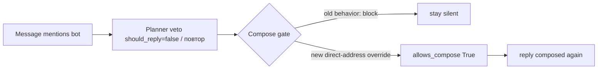

# Plan: repeated identical messages must be treated as spam/junk, not re-answered

## Symptom

A person writes the same thing many times; Vanessa keeps replying to each repeat
instead of recognizing it as junk. Report: «человек пишет много раз одно и то же,
а ванесса постоянно отвечает, не считая это мусором, хотя должна».

## Why repeats currently get through

There are two suppression layers for a repeated message, and BOTH are currently
broken:

### 1. Deterministic `RepeatedQuestionRule` never fires for the reported case

[`app/decision/repeated_question.py`](../app/decision/repeated_question.py:119)
fires only on a **near-pure repeat of an already-answered** prior user message:

- `message_tokens` requires `len(current) >= 3` content words (stopwords removed),
  so a short spam like «ванесса», «ну», «чё», «давай» never reaches the rule;
- `is_pure_repeat` requires the current message's tokens to be a subset of the
  prior tokens with >= 60% coverage — a short filler never matches a longer one;
- `_answered_later` requires an assistant reply to have been interleaved right
  after the prior user message — a rapid burst (5 identical messages before any
  reply) makes every prior copy look "unanswered", so none is suppressed;
- the window is only the last 8 messages, and there is no notion of "same message
  sent N times" as spam — only "repeat of a previously answered question".

Net effect: an identical burst or short repeated phrase is never classified as
`REPEATED`, so it proceeds to the planner.

### 2. The previous compose-gate fix now overrides the planner's own veto

The planner prompt ([`config/content/rag.yaml`](../config/content/rag.yaml:77))
already tells the model: repeated question → `should_reply=false, skip=true`.
When the LLM planner agrees and returns `should_reply=false`, the turn reaches
[`ComposeGatePolicy`](../app/decision/gate/compose_gate.py:25) →
[`ReplyEligibility.should_block_compose`](../app/decision/gate/reply_eligibility.py:284).

The recent fix for the "ванесса + императив" bug added a **direct-address
override**: `should_block_compose` now falls through to `allows_compose` when the
message mentions the bot, instead of honoring `should_reply=false`. That fix was
correct for a genuine imperative, but it is unconditional — so a planner veto on a
**repeated** message that mentions the bot (e.g. «ванесса, ну чё там с мешем»
sent 5 times) is now also overridden, and the reply is composed again.

## Design

Fix at three levels, defense-in-depth, so both layers above work:

### Fix 1 — deterministic repeated-message spam detection (`RepeatedQuestionRule`)

Extend [`RepeatedQuestionRule`](../app/decision/repeated_question.py:119) with a
**same-sender repeated-message** detector (spam burst), independent of the
"answered question" path:

- Add `is_repeated_message(text, recent, *, sender_id)` — true when the same
  normalized content appears more than once among recent user messages from the
  **same sender** (ignore case/punctuation/spacing; keep stopwords, unlike
  `message_tokens`, so «ванесса» matches «ванесса»).
- Fire `IGNORE/REPEATED` when:
  - the same sender sent the same content >= `N` times in the recent window
    (start `N=2`, configurable via a constant or `config/content/decision.yaml`),
    **regardless of whether it was answered** — a burst is spam, not a question;
  - OR the current message is a pure repeat of a prior same-sender message that
    WAS answered (existing near-pure path, widened to include short messages).
- Keep the existing near-pure-repeat logic for the "shortened re-ask of a long
  answered question" case.
- Respect `sender_telegram_id` so person A's repeated message is not suppressed by
  person B's similar message.
- Add a `DecisionReason.REPEATED` short-circuit **before** `IntentRule` /
  `DirectAddressRule`, so a deterministic repeat never reaches compose.

### Fix 2 — compose-gate: planner veto must win over the direct-address override for repeats

Refine [`ReplyEligibility.should_block_compose`](../app/decision/gate/reply_eligibility.py:284)
so the "ванесса + императив" override stays narrow:

- Thread a `repeated: bool` (or `is_repeat`) signal into `should_block_compose`
  (computed from `recent_messages` via the same `is_repeated_message` helper),
  in addition to `should_reply`.
- When `should_reply is False`:
  - if the message is a **repeated message** → `return True` (honor the veto, the
    direct-address override must NOT rescue a repeat);
  - else keep the existing direct-address override (a genuine imperative is not a
    repeat, so it still composes).

`ComposeGatePolicy` already passes `context.text`/flags; extend it to pass
`recent_messages` (already on `DecisionContext`) so the eligibility check can
compute the repeat verdict.

### Fix 3 — planner prompt reinforcement

[`config/content/rag.yaml`](../config/content/rag.yaml:77) "Repeated question"
section: add an explicit bullet that the **same sender repeating the same message
several times** (even without new detail) → `should_reply=false, skip=true`,
reason «повтор сообщения». Also mention it under `## reason` examples so the
`reason` string stays meaningful for traces.

## Tests

1. `tests/decision/test_repeated_question.py` — new cases:
   - identical short spam burst from same sender → `IGNORE/REPEATED`;
   - identical message from a different sender → not suppressed;
   - answered pure repeat still suppressed; unanswered single re-ask still allowed;
   - near-pure repeat of a long answered question still suppressed.
2. `tests/decision/test_decision_engine.py` — end-to-end: same message sent N
   times → `IGNORE/REPEATED` (and no compose).
3. `tests/decision/test_reply_eligibility.py` — compose gate: planner veto +
   repeated message + mentions_bot → `should_block_compose=True`;
   planner veto + non-repeated imperative + mentions_bot → `False` (regression
   guard for the previous fix).
4. `tests/llm/test_turn_planner.py` — prompt-content assertion that the repeated
   same-sender message rule is present in `rag.yaml`.

## Files touched

- `app/decision/repeated_question.py` — same-sender repeated-message detector.
- `app/decision/gate/reply_eligibility.py` — `should_block_compose` honors veto on
  repeats; thread `recent_messages` / repeat signal.
- `app/decision/gate/compose_gate.py` — pass `recent_messages` into the check.
- `config/content/rag.yaml` — planner prompt reinforcement.
- tests: `test_repeated_question.py`, `test_decision_engine.py`,
  `test_reply_eligibility.py`, `test_turn_planner.py`.
