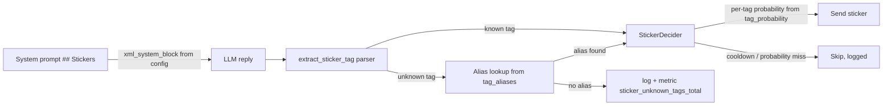

# Sticker engagement upgrade

Improve sticker format and logic: per-tag send probability, an XML tag
cheat-sheet generated from config for the LLM prompt, and a soft fallback +
observability for unknown tags emitted by the model. Also refresh the pack
config against the live Telegram sticker set.

## Decisions (confirmed with user)

- The sticker cheat-sheet in the system prompt is **generated as XML from
  `config/content/stickers.yaml`** — the yaml stays the single source of truth
  for tags.
- Tag set: **add `tease`** (😏 smirk), **keep `weary`** (🫤 — it is still in the
  live pack). Laughter stays `delight` (no separate `laugh` tag).
- `file_id` / `index` values are re-synced from the live pack via
  `scripts/export_sticker_pack.py`, and the bot treats the live pack as the
  source of truth at startup: `resolve_file_ids` refreshes even baked `file_id`s
  (emoji-first matching), so stale Telegram links heal automatically.

## Current state

- [`config/content/stickers.yaml`](../config/content/stickers.yaml) — global
  `probability: 0.6` + `heuristic_probability: 0.45`, 8 stickers, no per-tag
  probability, no alias map.
- [`StickersContent`](../app/config/content.py:282) — fixed `probability`,
  `tag_lines()` renders the prompt tag list.
- [`extract_sticker_tag`](../app/llm/format/sticker_tag.py:47) — strips
  `[sticker:...]`; unknown tags are silently stripped and dropped (no mapping,
  no logging, no metric).
- [`StickerDecider.decide`](../app/bot/stickers/decider.py:48) — single global
  probability for all tags.
- [`PromptBuilder.system_prompt`](../app/llm/prompts/prompt_builder.py:271) —
  appends `## Stickers` with [`sticker_instruction`](../config/content/llm.yaml:111)
  + `tag_lines()`.
- [`export_sticker_pack.py`](../scripts/export_sticker_pack.py) — prints
  index/emoji/file_id only (manual copy into yaml).
- Runtime [`resolve_file_ids`](../app/bot/stickers/catalog.py:27) skips stickers
  that already have an explicit `file_id` (so stale config ids are never refreshed).

## Target flow



## Changes

### 1. Config — `config/content/stickers.yaml`

- Remove `weary`; add `tease` (name `smirk`, tags `[tease]`, emoji `😏`,
  description for "ироничная ухмылка, лёгкий флирт, подкол").
- Add `tag_probability` (per-tag override of the base `probability`):
  `love 0.8`, `delight 0.75`, `greeting 0.6`, `farewell 0.6`,
  `irritation 0.5`, `thinking 0.4`, `embarrassment 0.6`, `bemused 0.5`,
  `tease 0.6`.
- Add `tag_aliases` for soft fallback, e.g. `angry -> irritation`,
  `happy/lol/laugh -> delight`, `bye -> farewell`, `hi/hello -> greeting`,
  `thanks/thx -> love`, `sorry -> embarrassment`, `ok -> bemused`.
- Add `system_description` (intro text for `<description>`, Russian, from the
  user's example) and `tag_rules` (list of `<rule>` strings: max one tag per
  message, tag at the very end, no tags on neutral/serious/work topics).
- Refresh `file_id` / `index` from the live pack via
  `python scripts/export_sticker_pack.py --update`.

### 2. Config model — `app/config/content.py`

- `StickersContent` gains fields: `tag_probability: dict[str, float]`,
  `tag_aliases: dict[str, str]`, `system_description: str`,
  `tag_rules: list[str]` (with ge/le validation on probabilities).
- Add `xml_system_block() -> str` that builds:

  ```xml
  <sticker_system>
    <description>...</description>
    <available_tags>
      <tag name="love">❤️ (heart) — тепло и одобрение</tag>
      ...
    </available_tags>
    <tag_rules>
      <rule>...</rule>
    </tag_rules>
  </sticker_system>
  ```

  Tag lines reuse each sticker's `emoji`, `name` and `description` (tag is the
  single source of truth, deduped). Keep `tag_lines()` for backward compat.

### 3. Per-tag probability — `app/bot/stickers/decider.py` + `app/bot/container.py`

- `StickerDecider.__init__` accepts `tag_probability: Mapping[str, float] | None`.
- In `decide()`, compute:
  `base = self._probability if from_llm else self._heuristic_probability`
  then `probability = self._tag_probability.get(chosen_tag, base)`.
- `app/bot/container.py` passes `tag_probability=stickers_config.tag_probability`.
- `force` path still bypasses probability as today.

### 4. Unknown-tag soft fallback — `app/llm/format/sticker_tag.py`

- Load `TAG_ALIASES` from config next to `KNOWN_STICKER_TAGS`.
- In `_strip_markers`: known tag wins as today; unknown tag is looked up in
  `TAG_ALIASES`; if found, use the mapped known tag; otherwise drop.
- Never crash, never leak the marker into the reply text.
- Log `sticker_unknown_tag raw=<tag> action=mapped|dropped target=<known|->`
  and increment the counter (below).

### 5. Observability — `app/observability/metrics.py`

- Add `sticker_unknown_tags_total` Counter with label `action`
  (`mapped` / `dropped`) on the app `registry`.
- Optionally `sticker_tagged_total` Counter with label `tag` for tag-usage
  visibility (nice-to-have).

### 6. Prompt — `app/llm/prompts/prompt_builder.py` + `config/content/llm.yaml`

- `## Stickers` section becomes: `sticker_instruction` prose (kept as the
  "when to add / user asks -> perfect fit / you don't choose the final sticker"
  notes) followed by `stickers.xml_system_block()`.
- Trim the duplicated "one tag per reply / tag at the end" rules out of
  `sticker_instruction` since `tag_rules` now carry them.

### 7. Export script — `scripts/export_sticker_pack.py`

- Add `--update`: fetch the live pack, rewrite `file_id`/`index` for each yaml
  sticker matched by `index` or `emoji`, and print new pack stickers that are
  not yet in the yaml (with a ready-to-paste entry) — this is how `tease` gets a
  real `file_id`.

### 8. Tests

- `tests/bot/test_sticker_catalog.py` — weary -> tease assertions,
  `len(stickers.stickers) == 8` stays, add `xml_system_block` sanity checks.
- `tests/bot/test_sticker_decider.py` — per-tag probability override cases.
- `tests/llm/test_sticker_tag.py` — alias mapping (`angry -> irritation`),
  unmapped unknown still dropped, marker never leaks.
- `tests/llm/test_knowledge_prompt.py` — assert the XML block
  (`<sticker_system>`, `<available_tags>`) instead of the old
  `"Available sticker tags"` text.
- `tests/bot/test_sticker_service.py` — update fixture tag set.
- New coverage: `xml_system_block` renders well-formed XML and stays in sync
  with `available_tags`.

### 9. Verification

- `pytest` full suite green.
- Inspect a rendered prompt: sticker section is valid XML, tags match the pack.
