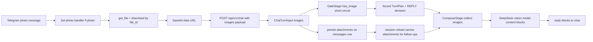

# Vision Integration: DeepSeek-V4-Flash-Vision-Exp for the Telegram Bot

## Goal

Add image understanding to the VanessaAI Telegram bot using the DeepSeek
vision model (`deepseek-v4-flash-vision-exp`) via the OpenAI-compatible
Chat Completions endpoint. The bot downloads a Telegram photo by `file_id`,
encodes it as a base64 data URL, and sends it to the model as `image_url`
content blocks alongside the existing text prompt. Images are persisted so
follow-up questions («а переведи вон ту надпись на ней») can reference a
previous image through the session context.

## Decisions (confirmed with user)

1. **Reply policy** — the bot auto-replies to ANY photo in allowed chats
   (auto-description / OCR). No conservative gating needed.
2. **Storage** — image bytes are stored as a base64 data URL directly in the
   DB (`attachments` column on the `messages` table). Follow-up works via the
   normal session reload. Size is bounded by picking a Telegram-provided photo
   size that fits a byte cap (no new image library required).
3. **Provider** — vision is DeepSeek-only for now; Claude accepts the new
   `images` parameter as a no-op to keep the shared protocol stable.

## Architecture



## Message path today (text-only)

```
Telegram text -> IncomingMessage.from_telegram -> to_api_payload
  -> HttpChatApiClient.process -> POST /api/v1/chat (SSE)
  -> ChatRequest -> ChatTurnInput(message: str)
  -> ConversationOrchestrator -> Gate/Retrieve/Compose/Finalize stages
  -> DeepSeekLLMProvider.generate -> chat.completions.create(content: str)
```

Everything above is text-only: there is no photo handler, no image field on
the message model, and the LLM call sends a plain string `content`.

## Change plan (by layer)

### 1. Config (`app/config/settings.py`, `.env.example`)

New settings:

- `deepseek_vision_model: str = "deepseek-v4-flash-vision-exp"`
- `vision_enabled: bool = True` (master switch)
- `vision_max_image_bytes: int = 1_500_000` (pick a Telegram photo size whose
  `file_size` fits this cap; base64 adds ~33% on top)
- `vision_session_images: int = 2` (max prior session images attached for
  follow-ups)
- `vision_max_images_per_turn: int = 2` (cap images sent per LLM call)
- `vision_photo_placeholder: str = "[фото]"` (DB/session text for a bare photo)

### 2. Domain model (`app/core/messages.py`)

- New frozen dataclass `ImageAttachment(data_url, mime_type, telegram_file_id)`.
- `ContextMessage` and `StoredMessage` gain `attachments: tuple[ImageAttachment, ...]` / `list | None`.
- `stored_to_context()` maps the DB `attachments` JSON into `ImageAttachment`s.

### 3. DB layer

- Alembic migration `alembic/versions/007_message_attachments.py`: add
  `attachments` JSONB column to `messages` (nullable).
- `app/db/models.py`: `Message.attachments` column.
- `app/db/repository.py`: `MessageRepository.create(..., attachments=None)`
  serializes dicts; mapper populates `StoredMessage.attachments`.
- `app/core/protocols.py`: `MessageRepositoryProtocol.create` gains
  `attachments` parameter.

### 4. API layer

- `app/api/schemas/chat.py`: `ChatImage(data_url, mime_type, telegram_file_id)`
  pydantic model + `images: list[ChatImage] = []` on `ChatRequest`.
- `app/api/routes/chat.py`: map `body.images` into `ChatTurnInput(images=...)`.

### 5. Turn input (`app/core/turn.py`)

- `ChatTurnInput.images: tuple[ImageAttachment, ...] = ()`.
- Helper property `has_image`.

### 6. Bot message model (`app/bot/messages/message.py`)

- `IncomingMessage.images: tuple[ImageAttachment, ...] = ()`.
- `from_telegram()` uses `message.text or message.caption or ""` so photo
  captions become the message text; accepts an `images` override.
- `to_api_payload()` includes `"images": [...]`.
- Bare photos get `text = settings.vision_photo_placeholder` so the API schema
  (`min_length=1`) and DB stay consistent.

### 7. Bot photo handler (`app/bot/handlers/messages.py`)

- New `@router.message(F.photo)` handler (photos with a caption too):
  - pick the largest `message.photo` size whose `file_size <= vision_max_image_bytes`;
  - `bot.get_file(file_id)` + `bot.download_file(file.file_path)` -> bytes -> base64 data URL;
  - build `IncomingMessage` with `text = caption or placeholder` and `images`;
  - reuse the existing shared core (`_handle_text_core`-style: access guard,
    `services.chat_client.process`, block delivery, stickers).
- Download/encode failures: log and fall back to a text-only turn (caption) or
  drop silently — never raise into the handler.

### 8. Orchestrator persistence (`app/services/orchestrator/conversation_orchestrator.py`)

- Pass `turn.images` (serialized) into `messages.create(attachments=...)` so the
  image survives for the session window and follow-up turns.

### 9. Pipeline vision short-circuit (`app/services/pipeline/stages.py`)

In `GateStage.run`, right after owner-ignore handling, when
`ctx.turn.has_image and settings.vision_enabled`:

- skip the prefilter and reaction-gate short-circuits (empty/noise text must
  not drop a photo);
- build a forced `TurnPlan` (`should_reply=True`, `skip_search=True`,
  `text=caption` or a vision marker) and a minimal
  `DecisionResult(action=REPLY, reason="vision_photo")`;
- return `True` to proceed to Retrieve/Compose. (`FinalizeStage` asserts a
  non-None decision, so the forced decision is required.)

When `vision_enabled=False`, photo turns fall back to today's behavior.

### 10. ComposeStage (`app/services/pipeline/stages.py`)

- Collect images for the LLM call:
  - current turn images (`ctx.turn.images`);
  - attachments from recent session messages, bounded by
    `vision_session_images`, preferring the reply-to message's image first;
  - capped at `vision_max_images_per_turn`.
- Pass the combined list to `llm.generate(..., images=...)`.

### 11. LLM providers

- `app/llm/providers/deepseek.py`:
  - `generate(..., images: list[ImageAttachment] | None = None)`.
  - When `images` is non-empty: use `settings.deepseek_vision_model`; build
    `content` as a list of blocks:
    `[{"type": "text", "text": user_prompt}, {"type": "image_url", "image_url": {"url": data_url}}, ...]`.
  - Otherwise keep the existing string-content path (backwards compatible).
  - Log `llm_vision model=... images=...` and add vision metadata to the trace.
- `app/llm/providers/claude.py`: accept `images` as a documented no-op.
- `app/core/protocols.py`: add `images` to `LLMProviderProtocol.generate`.

### 12. Prompt (`config/content/llm.yaml`, `app/llm/prompts/prompt_builder.py`)

- Add `vision_note:` instruction (e.g. «К текущему сообщению прикреплено
  изображение. Если пользователь спрашивает про картинку — опиши её, прочитай
  текст (OCR), разбери графики/интерфейсы. Если мелкий/нечёткий текст —
  скажи об этом прямо, не выдумывай»).
- `PromptBuilder.build_user_prompt(..., has_image=False)` appends the note
  when an image is attached.

### 13. Observability

- `llm_vision` log line in the provider (model + image count).
- Trace metadata `{"vision": True, "images": N}`.
- Reuse existing `record_llm_call` — the vision model name and image token cost
  (~384 tokens/image) already flow into `vanessa_llm_cost_total`.

### 14. Tests

- `tests/llm/test_deepseek.py`: content becomes a block list and model routes
  to the vision model when images are present; string path unchanged otherwise.
- `tests/db/test_mappers.py` (or core): `stored_to_context` maps attachments.
- `tests/api/test_api_chat.py`: `ChatRequest` accepts images; route maps them.
- `tests/services/test_orchestrator.py`: orchestrator persists attachments.
- `tests/bot/...`: photo handler downloads + attaches an image (mock
  `bot.get_file` / `download_file`); bare photo forced-reply.
- `tests/services/test_orchestrator.py` / gate tests: vision short-circuit
  produces a REPLY decision.

### 15. Docs & deploy

- README note on enabling vision (`DEEPSEEK_VISION_MODEL`).
- `scripts/zero_downtime_deploy.sh` and `.github/workflows/deploy.yml` need no
  change (JSONB migration is additive, runs via `alembic upgrade head` in the
  api container).

## Notes / future considerations

- The DeepSeek model auto-resizes images to ~800x800 (~384 tokens/image), so
  sending Telegram's largest fitting size is cheap. A downscale step (Pillow)
  is optional and not required for the MVP.
- The vision model is experimental — small text / complex UIs can hallucinate;
  the `vision_note` prompt asks the model to be honest about unclear text.
- Rate limiting on photo turns is intentionally bypassed for MVP (per user
  choice); a per-chat photo cap can be added later if spam becomes an issue.
